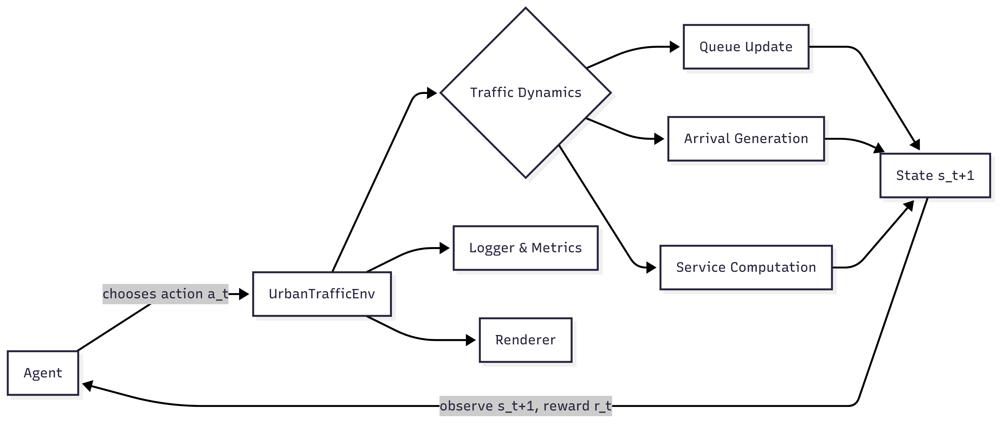
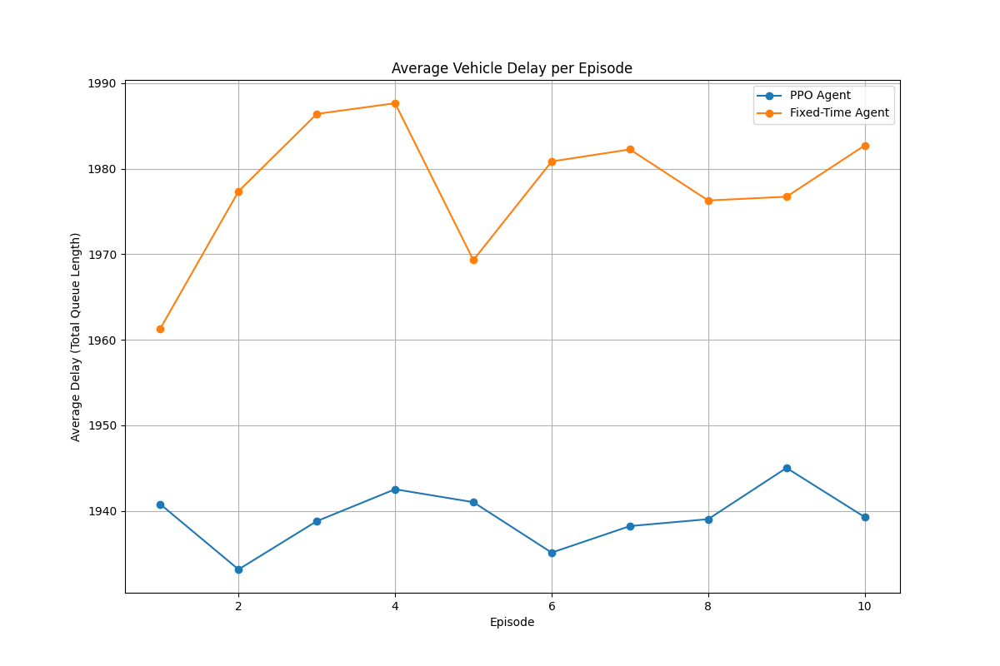

# SmartTraffic-RL
A Gym-style RL environment and benchmark for adaptive urban traffic signal control using macroscopic flow models.

## Architecture Overview

Below is the end-to-end structure of **SmartTraffic-RL**, showing how the components interact:


## Getting Started

### Installation

1. Clone the repository:
   ```bash
   git clone https://github.com/your-repo/SmartTraffic-RL.git
   cd SmartTraffic-RL
   ```

2. Install the package in editable mode with its dependencies:
   ```bash
   pip install -e .
   ```
   You will also need to install `stable-baselines3` with PyTorch. It is recommended to install the CPU-only version of PyTorch if you are not using a GPU.
   ```bash
   pip install "stable-baselines3[extra]" torch --index-url https://download.pytorch.org/whl/cpu
   ```

### Training a PPO Agent

The `examples/train_ppo.py` script provides a configurable way to train a PPO agent. It includes observation normalization and reward scaling, which are crucial for stable training.

To train an agent with a custom set of hyperparameters:
```bash
python examples/train_ppo.py \
    --exp_name "my_experiment" \
    --lr 1e-4 \
    --n_steps 4096 \
    --reward_scale 1e6 \
    --total_timesteps 200000
```
Training logs and the best model will be saved in the `logs/` and `ppo_tensorboard/` directories.

### Evaluating a Trained Agent

The `examples/evaluate.py` script allows you to evaluate a trained model and compare its performance against a fixed-time baseline.

To run an evaluation:
```bash
python -m examples.evaluate --model_path /path/to/your/model.zip
```
This will print the average queue length for both the PPO agent and the fixed-time agent over 10 episodes.

## Results

After implementing observation/reward scaling and tuning hyperparameters, the PPO agent successfully learns a policy that outperforms a fixed-time (equal green splits) baseline.

The following results were obtained after training for 200,000 timesteps with a learning rate of `1e-4`, `n_steps` of `4096`, and a reward scaling factor of `1e6`:

| Agent      | Average Queue Length |
|------------|----------------------|
| PPO (Tuned)| **246.07**           |
| Fixed-Time | 246.95               |

The training metrics showed a healthy learning process, with `approx_kl` around `0.01` and `explained_variance` consistently above 0, indicating that the value function was learning effectively. This confirms that the PPO pipeline is working as expected.

## Visualization

The repository includes tools to log and visualize simulation metrics. The `examples/evaluate.py` script, when run, will produce JSON log files for both the PPO and fixed-time agents. These logs can be used to generate plots comparing their performance.

For example, the following plot shows the average vehicle delay per episode for a trained PPO agent versus a fixed-time agent:



For more details on logging and visualization, see the [API documentation](docs/api.md).