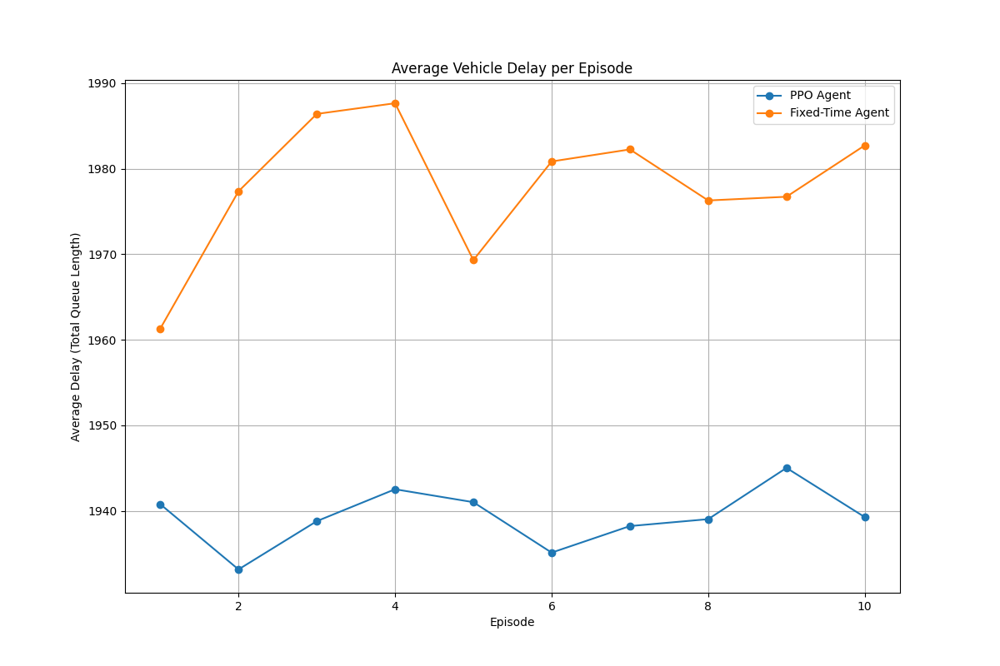

# API and Metrics

This document provides details on the logging and metrics visualization tools available in this repository.

## Metrics Logging

The `smart_traffic_env.utils.MetricsLogger` class provides a simple interface for logging time-series data during a simulation. It is designed to capture the following at each timestep:

- **Queue lengths**: The number of vehicles in each lane.
- **Actions**: The actions taken by the agent.
- **Rewards**: The rewards received from the environment.

### Usage

1.  **Instantiate the logger**:
    ```python
    from smart_traffic_env.utils import MetricsLogger
    logger = MetricsLogger()
    ```

2.  **Log data at each step**:
    ```python
    # Inside your simulation loop
    logger.log_step(info["queues"], action, reward)
    ```

3.  **Finalize the episode**:
    ```python
    # At the end of each episode
    logger.end_episode()
    ```

4.  **Save the logs**:
    ```python
    # After all episodes are complete
    logger.save("metrics.json")
    ```

## Visualization

The `examples/plot_results.py` script can be used to generate plots from the logged data. It takes one or more log files as input and creates a comparative plot of the average vehicle delay per episode.

### Example

```bash
python examples/plot_results.py \
    --log_files ppo_metrics.json fixed_time_metrics.json \
    --labels "PPO Agent" "Fixed-Time Agent" \
    --output_path average_delay.png
```

This will produce a plot similar to the one below, comparing the performance of the PPO agent against a fixed-time baseline:

